# Godot Bite Sized Player - 2D

This repo represents the Godot Bite Sized Player - 2D. What is a Bite Sized Player - 2D, you might ask? The answer is in two parts. First, it's the player object that is being created under my (Godot Bite Sized content series)[https://github.com/timjbruce/godotbitesized]. In this series, I take a 5-10 lesson and make something concrete for developers to follow along / learn about Godot. Second, it is the 2D Player object that will be used in games that I create. It will be a component that can be copies (or used as a plug-in, I'm not dropping that goal!) in a 2D game and offer capabilities to get game developers started. A working game, no matter how small the increment, is the goal!

## Build 1

For Build 1, we're going to form the _very_ basic Player for a game. For 2D Games, this means a 2D Scene with an image that can move in different directions. For 2D games in Godot, we should use (CharacterBody2D)[https://docs.godotengine.org/en/stable/classes/class_characterbody2d.html] as the base object. This gives us a bunch of capabilities, like handling physics so it can move. Your end project will look something like this when you look at the file browser:

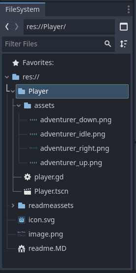

I've already started a new project, called Player. The first thing I'm going to do is create a new folder called "Player" in the file system. This sub folder gives me the ability to easily move components from one project to another and keeps objects from name conflicts. When I move this component into another game, I'll create a "Player" folder in that game and copy the objects from my "Player" folder there. Now, I probably wouldn't have 2 objects named "Player" in a game, but I might have two objects with the same name sometime in a complex game. 

Great, so the "Player" folder is there, now lets start creating the "Player" itself! Right click on the "Player" folder, select "Create New" and "Scene." This will open the new scene dialog. Change the Root Type to "CharacterBody2D," enter the Scene Name as "Player" and click "OK." This will create an empty scene with the CharacterBody2D as the base object.

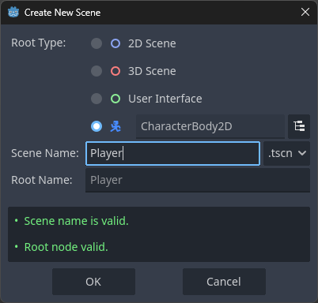

You'll notice in the Scene window that there is a yellow triangle that is warning you that there is no shape added to the CharacterBody2D to deal with collisions. By the end of this session, we'll have that addressed.

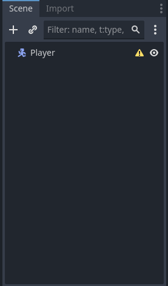

Let's go ahead and add a few other Godot Nodes to our Player. Specifically, we're going to add AnimatedSprite2D, to play animations, CollisionShape2D, to detect collisions, Label, to display some text, and Camera2D, to follow the player around when our game world is bigger than our window. Right click on the Player in the scene window click on "Add Child Node" and add these three nodes. Your Player Scene should look like this at the end.

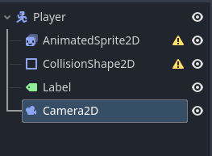

Notice that the Yellow warning is now gone on the CharacterBody2D, but it now exists on the AnimatedSprite2D and CollisionShape2D. We'll get to fixing those shortly! Let's start filling in our Player object with details.

The first thing we're going to do is to add in the animated sprites for the Player movement. We want to show these when the Player moves on the screen. I've placed my assets into the "Player/assets" folder. Again, this allows me to move this component and not worry about naming conflicts for other components.

Click on the AnimatedSprite2D in the Scene browser. In the Inspector, you'll see Sprite Frames as an option in the AnimatedSprite2D section. Click the dropdown and select "Sprite Frames." Click on the text entry for "Sprite Frames" again and it will open the "Animation" window at the bottom.

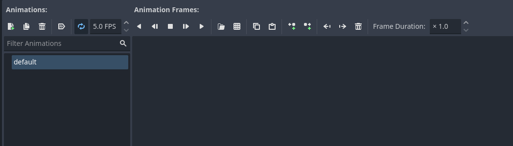

Now we are going to add animations for the player, specifically to move up, down, walk, and idle. Notice there isn't a left and right - that's because we'll use a trick with the images for walk to do both left and right! First, let's get the named animations in. Double-click on default and rename it "idle." Then, click the "Add" button and add the animations for up, down, and walk individually. You will rename the "New Animations" by double clicking on them and typing the name you want. Your Animation window should look like this at the end.

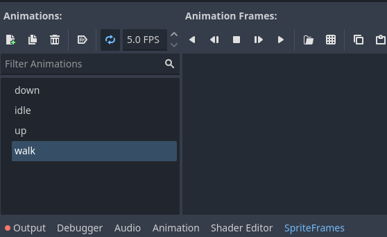

In this next step, we will add the assets for the animations. My assets are sprite sheets that need to be separated out into frames. Luckily, Godot supports sprite sheets and this process will be fairly easy! Let's walk through "down" in detail.

Click on the "Add Frames from Sprite Sheet" button in the Animation Frames section.

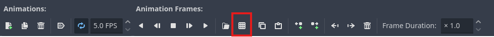

Next, navigate to the "Player/assets" folder and select the `adventurer_down.png` file. This will bring up a window where we can select frames. If you use my image, you can enter in 4 Horizontal frames and 1 Vertical frame to slice the image. Then, select each of the "frames" by clicking on it, starting from the left and going right. The dialog should look like this.

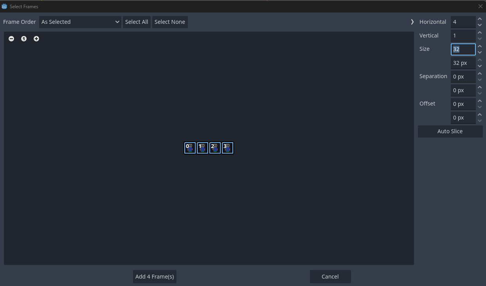

Click on the button that reads "Add 4 Frame(s)" and the images should be added to the animation window like this.

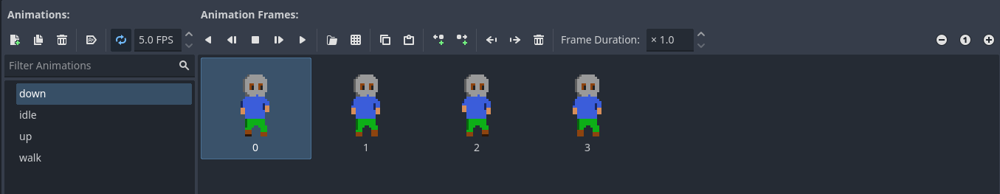

Now repeat this same process for the other 3 animations, using `adventurer_idle.png` for "idle," `adventurer_right.png` for "walk," and `adventurer_up.png` for "up." For "right," you will need to change the frames to 5 Horizontal and 1 Vertical and select all 5 frames.

The player might look a little small when loaded. We can do a quick fix on that. Select the "AnimatedSprite2D" node in your scene browser, go into the "Transform" section of the inspector and set the scale to 2 for x and 2 for y. If you have these linked, you should only have to change it for x and it will also change for y.

Next, we will update the CollisionShape2D object. Select it in the Scene Browser. The CollisionShape2D needs a shape that works with the AnimatedSprite2D shape. This will help your collisions seem more accurate to players when they play your game. In the Inspector, click on the down arrow by "Shape" and select "RectangleShape2D."

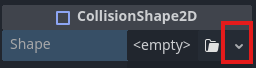

When you do, a rectangle will appear over the Player. Resize and move the rectangle, as needed, so that it covers the player like this.

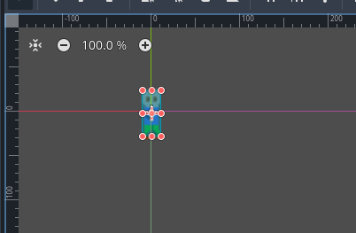

One last thing before we add some code and try this out is to add text to the label to call this "Player." Click on the Label in the Scene browser. In the Inspector window, enter "Player" in the Text field. Finally, move the label in the Scene browser so that it looks like this.

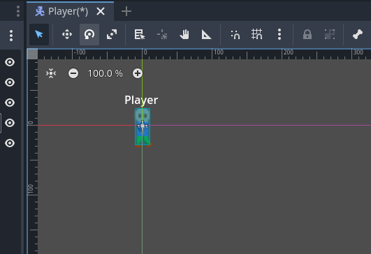

We are down to two last steps for this version of this component. We still need to add the input map for the project so we can test this and, also, a bit of code so we can see the Player move around. Let's take care of the input map first.

Open the Project Settings dialog by selecting the "Project -> Project Settings..." menu. Click on the "Input Map" tab so we can add new actions. We're going to add actions to move the player "up," "down," "left," and "right" using the arrow keys (or WASD, if you want) and left joystick controller (if you don't have a controller, you can skip this part). Here are the steps for "up" and you can repeat these for the other directions.

Type in "up" for the action and click on the +Add button. This will add the "up" action to the Input Map.

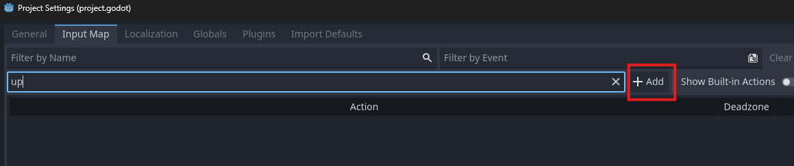

Next, click the "+" next to "up" to open a dialog to add events that can trigger "up" to occur. This dialog box listens for input, making it easy to add the keys. Press the up arrow or W key to add it

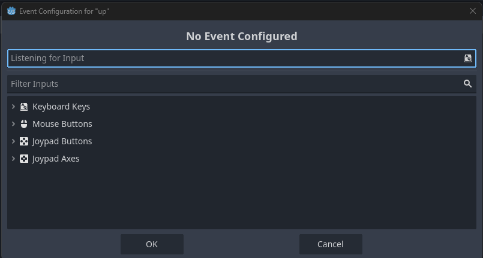

Click the "+" again and now press the left joystick on your controller up to assign it to up, as well

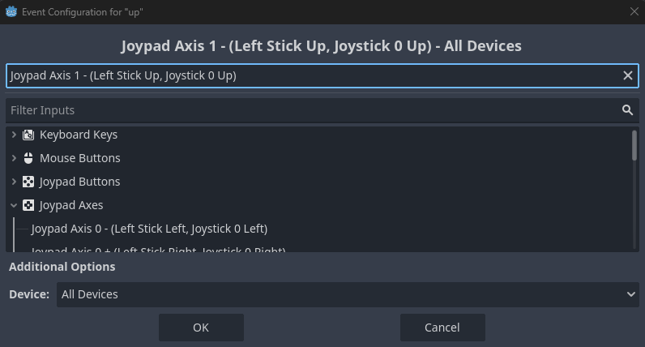

Repeat this process for "down," "left," and "right." The final output should look like this:

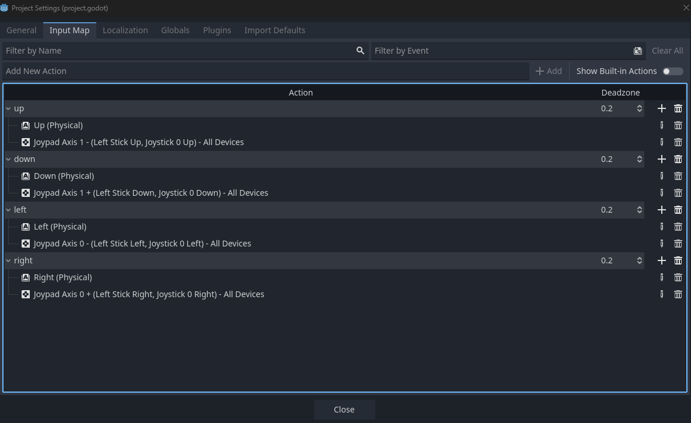

Click the "Close" button to return to the project.

For the final step, we're going to add some very basic code to the Player. To add code to the Player, click the Player in the Scene browser and click the "Add a new or existing script to the selected node" button.

Accept the defaults for the new script and the code browser window should appear. Replace what is in the code browser with the script below.

```
extends CharacterBody2D
class_name player_2d_body

var SPEED = 600

func _process(_delta: float) -> void:
	var x_direction: float = Input.get_axis("left", "right")
	var y_direction: float = Input.get_axis("up", "down")
	if x_direction:
		velocity.x = x_direction * SPEED
	else:
		velocity.x = move_toward(velocity.x, 0, SPEED)
	if y_direction:
		velocity.y = y_direction * SPEED
	else:
		velocity.y = move_toward(velocity.y, 0, SPEED)
		
	if velocity.x != 0:
		$AnimatedSprite2D.animation = "walk"
		$AnimatedSprite2D.flip_v = false
		$AnimatedSprite2D.flip_h = velocity.x < 0
	elif velocity.y < 0:
		$AnimatedSprite2D.animation = "up"
	elif velocity.y > 0:
		$AnimatedSprite2D.animation = "down"
	else:
		$AnimatedSprite2D.animation = "idle"
	$AnimatedSprite2D.play()
	
	move_and_slide()
```

This code will run within the Player class and look for the inputs we defined in the prior step. When the events are triggered, floats are sent to the variables that are then calculate the velocity of the CharacterBody2D. We want a gliding motion, so `move_toward` is used to allow the Player to gradually slow down. It's a pretty quick slow down with this component right now.

After the velocity is calculated, the animation is selected. If the Player is walking right or left, the "walk" animation is used. If they are moving left, the images are flipped horizontally to show the animation moving left. Finally, `move_and_slide()` is called to move the body based on the velocity.

If you want, you can play this scene using the F6 key. Note that the Player animations play but the Player doesn't move around the screen. This is because of the Camera2D node keeping the player in the middle of the screen. You can override this setting by clicking the "Override the in-game camera" button. Because there is no game world for this component, your Player is allowed to move off the screen and back onto it!

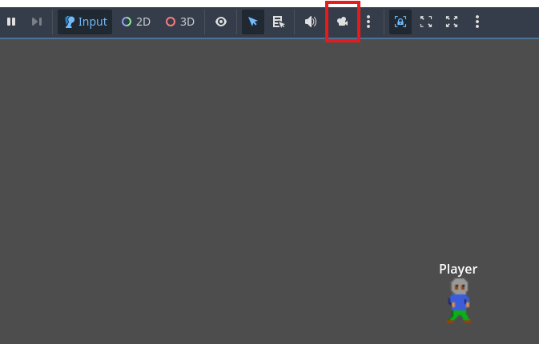

Happy Building and I'll see you for the next component build!